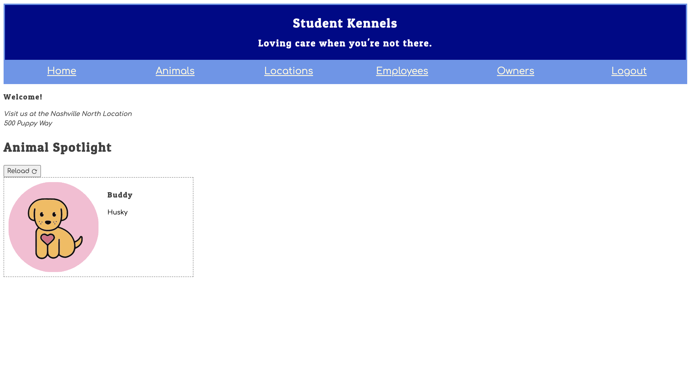

# Kennel App

Single page browser application to manage and display animals in kennel, employees, locations and pet owners. This was my first project and introduction to using React.

## Usage

### Login

Simple login system using email address to access Animals, Employees and Owners routes.

### Home

Welcome page with randomized animal spotlight carousel showcasing current animals in the kennel.

### Animals

Page contains list of animals in kennel with ability to view animal details, edit animal data (name, breed, employee responsible), discharge animal from kennel, and admit new animal to the kennel.

### Locations

Page contains list of animal kennel locations with ability to view location details, edit location info (name, address), close location, and add a new location.

### Employees

Page contains list of all employees employed at the kennel with ability to view all animals under the employee's care, edit employee's name, remove employee, and add new employee.

### Owners

Page contains list of all pet owners with ability to edit owner's name and email, remove owner, and add new owner.

## Learning Takeaways

- Using reuseable components
- Decoupling of components and logic
- Usage of React Router for multi-page routing
- Usage of React Hooks specifically (useState and useEffect)
